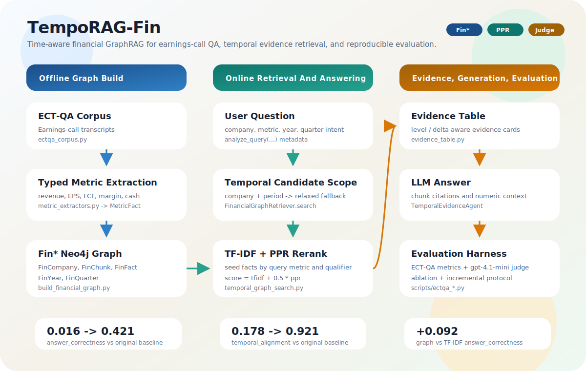

# TempoRAG-Fin Architecture

TempoRAG-Fin is a slim financial temporal GraphRAG research/evaluation project.
It keeps the ECT-QA data path, Fin* graph construction, temporal retrieval, and
evaluation scripts. The original generic GraphRAG agents, API server, and
frontend were removed from this copy. Curated evaluation summaries and headline
artifacts remain in `docs/`; ad-hoc run outputs should be written to `outputs/`.



## Repository Scope

| Area | TempoRAG-Fin implementation |
| --- | --- |
| Neo4j labels | `:FinCompany`, `:FinChunk`, `:FinFact`, `:FinYear`, `:FinQuarter` |
| Retrieval | `graphrag_agent/financial/temporal_graph_search.py` |
| Agent entry | `TemporalEvidenceAgent` in `scripts/ectqa_eval.py` |
| Evaluation | ECT-QA rules, LLM judge, ablation matrix, incremental protocol |

## End-to-End Flow

```text
ECT-QA transcripts
  -> ectqa_corpus.py
  -> chunk_document(...)
  -> EctChunk(company, year, quarter, text)

Offline ingest:
  EctChunk
  -> metric_extractors.extract_metric_facts(...)
  -> MetricFact(metric_key, value, unit, qualifier, value_kind, evidence_text)
  -> build_financial_graph.py
  -> Neo4j Fin* graph

Query time:
  user question
  -> EctQaCorpus.analyze_query(...)
  -> QueryMetadata(company, year, quarter)
  -> FinancialGraphRetriever.search(...)
  -> time/company scoped chunks
  -> PPR over FinFact <-> FinChunk
  -> TF-IDF + PPR blended rerank
  -> TemporalEvidenceAgent
  -> evidence cards + evidence table
  -> LLM answer with chunk citations
```

## Fin* Graph Schema

```cypher
(:FinCompany {name, stock_code, sector})
  -[:REPORTED]->
(:FinFact {
  fact_id,
  metric_key,
  metric_display,
  qualifier,
  value,
  raw_value,
  unit,
  period_year,
  period_quarter,
  period_type,
  value_kind,
  evidence_text,
  metric_phrase,
  confidence
})
  -[:IN_PERIOD]->(:FinQuarter {period, year, quarter})
  -[:OF_YEAR]->(:FinYear {year})

(:FinFact)-[:FROM_CHUNK]->(:FinChunk {chunk_id, text, year, quarter, company_name})
(:FinChunk)-[:OF_COMPANY]->(:FinCompany)
(:FinChunk)-[:IN_PERIOD]->(:FinQuarter)
```

The financial graph uses `Fin*` labels to keep the schema explicit and separate
from historical generic GraphRAG artifacts.

## Core Modules

| Module | Purpose |
| --- | --- |
| `graphrag_agent/financial/ectqa_corpus.py` | Shared ECT-QA loader and chunker for eval and graph ingest. |
| `graphrag_agent/financial/metric_extractors.py` | Deterministic named-metric extraction, qualifier detection, value_kind tagging, sanity bounds. |
| `graphrag_agent/financial/temporal_graph_search.py` | Time-scoped TF-IDF + PPR graph retrieval. |
| `graphrag_agent/financial/temporal_graph_facts.py` | Optional graph fact pack; off by default after negative ablation. |
| `graphrag_agent/financial/evidence_table.py` | Evidence table used by the prompt for numeric comparison. |
| `graphrag_agent/financial/fact_stitching.py` | ToG-style fact sentences; off by default after negative ablation. |
| `graphrag_agent/financial/pseudo_questions.py` | HopRAG-style pseudo questions; off by default after negative ablation. |
| `graphrag_agent/integrations/build/build_financial_graph.py` | ECT-QA to Fin* Neo4j ingest. |
| `scripts/ectqa_eval.py` | Main ECT-QA evaluation entry and `TemporalEvidenceAgent`. |
| `scripts/ectqa_ablation_matrix.py` | Ablation runner. Supports `--retriever graph`. |
| `scripts/ectqa_incremental_eval.py` | Base/retention/new protocol runner. Supports `--retriever graph`. |
| `scripts/ectqa_llm_judge.py` | Offline LLM judge over existing result JSON files. |

## Retrieval Algorithm

`FinancialGraphRetriever.search(query, top_k=8)`:

1. Analyze the query to infer company and time constraints.
2. Fetch scoped chunks from Neo4j with progressive relaxation:
   company + period -> company + year -> company -> time-only.
3. Build a fact-to-chunk graph from `FinFact` and `FinChunk`.
4. Seed Personalized PageRank on facts matching the query metric and qualifier.
5. Blend normalized in-scope TF-IDF with normalized PPR:

```text
score(chunk) = tfidf(chunk) + 0.5 * ppr(chunk)
```

6. Return hits in the same shape as `EctQaCorpus.search`.

## Design Decisions From Evaluation

- Chunk-first candidates are better than fact-only candidates. Fact-only retrieval lost too much recall.
- A global TF-IDF safety net was tested and reverted because it displaced useful scoped evidence.
- Fact sentences and pseudo questions were tested and left off by default because they did not improve formal `limit=100` results.
- The graph retriever is the main useful change: it improves answer correctness, numerical reasoning, and completeness under LLM judge.

## Run Commands

Build the financial graph:

```bash
PYTHONPATH=. python graphrag_agent/integrations/build/build_financial_graph.py \
  --scenario new \
  --corpus-scope full \
  --wipe
```

Run graph retrieval evaluation:

```bash
PYTHONPATH=. python scripts/ectqa_eval.py \
  --scenario new \
  --answer-filter answerable \
  --limit 25 \
  --agents TemporalEvidenceAgent \
  --metadata-filter boost \
  --retriever graph \
  --output-json outputs/smoke_graph.json \
  --quiet
```

Run incremental protocol through the graph retriever:

```bash
PYTHONPATH=. python scripts/ectqa_incremental_eval.py \
  --limit 25 \
  --agents TemporalEvidenceAgent \
  --retriever graph \
  --metadata-filter boost \
  --output-dir outputs/incremental_runs/graph_smoke \
  --summary-json outputs/ectqa_incremental_graph_smoke.json \
  --quiet
```

Run ablation matrix through the graph retriever:

```bash
PYTHONPATH=. python scripts/ectqa_ablation_matrix.py \
  --scenario new \
  --answer-filter answerable \
  --limit 25 \
  --agents TemporalEvidenceAgent \
  --retriever graph \
  --metadata-filter boost \
  --output-dir outputs/ablation_runs/graph_smoke \
  --summary-json outputs/ectqa_ablation_graph_smoke.json \
  --quiet
```

## Current Status

The financial temporal track is validated as an evaluation/research path. This
slim repository intentionally does not include the original FastAPI, frontend,
or generic agent stack.
