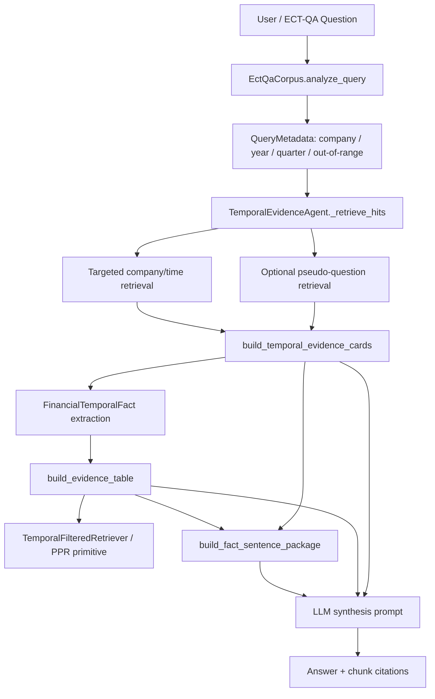

# 金融时序 RAG 改造说明

本文档记录当前项目从通用 GraphRAG 改造成金融时序 RAG 的工程入口、模块边界、评估协议和当前结论。

## 当前状态

已完成的主线能力：

- ECT-QA 数据集接入与原始 baseline 评估。
- `TemporalEvidenceAgent` 金融时序实验 Agent。
- 金融时间事实抽取：公司、股票代码、指标文本、数值、单位、年份、季度、周期类型、来源 chunk。
- 证据表：把抽取到的事实整理成可比较的结构化 rows。
- 时间过滤检索原型：按公司、年份、季度显式过滤，并做 coverage-first 选择。
- PPR 检索原型：在事实行之间按公司、时间、来源、单位、指标 overlap 建边并 rerank。
- ToG-style fact sentence：把事实行改写为 `company -> period -> metric -> value -> source_chunk` 路径句。
- HopRAG-style pseudo-question：用确定性伪问题做可选补召回。
- ECT-QA 增量评估协议：base / updated / new。
- 消融矩阵：table only、fact sentences、pseudo questions、组合增强。

尚未完全产品化的能力：

- PPR 原型尚未默认接入生成链路，只作为可测试检索 primitive。
- 金融时序能力目前主要在 `scripts/ectqa_eval.py` 的 `TemporalEvidenceAgent` 中验证，尚未替换生产 `LocalSearch`。
- 前端/API 证据链可视化尚未接入。

## 架构



## 关键文件

| 文件 | 作用 |
| --- | --- |
| `graphrag_agent/financial/temporal_facts.py` | 金融数字、时间事实、证据卡抽取。 |
| `graphrag_agent/financial/evidence_table.py` | 结构化证据表与周期/单位/指标相关性评分。 |
| `graphrag_agent/financial/temporal_graph_retrieval.py` | 时间过滤、coverage-first selection、PPR rerank 原型。 |
| `graphrag_agent/financial/fact_stitching.py` | ToG-style 事实路径句 + chunk excerpt 拼接。 |
| `graphrag_agent/financial/pseudo_questions.py` | HopRAG-style 确定性伪问题补召回。 |
| `scripts/ectqa_eval.py` | ECT-QA 主评估脚本和 `TemporalEvidenceAgent`。 |
| `scripts/ectqa_incremental_eval.py` | base / updated / new 增量评估协议。 |
| `scripts/ectqa_ablation_matrix.py` | 消融矩阵 runner。 |
| `scripts/ectqa_llm_judge.py` | 离线 LLM judge。 |
| `docs/dev_log.md` | 开发阶段、修改内容、测试结果、前后对比记录。 |

## 与参考工作的对应关系

| 参考方向 | 项目中对应实现 | 当前策略 |
| --- | --- | --- |
| Temporal-GraphRAG | 公司、指标、年份、季度、周期类型、来源证据 | 先在 ECT-QA 上做时序事实层，再逐步迁移到图谱构建。 |
| ToG-2 | fact sentence + source chunk stitching | 作为 prompt 的事实路径骨架，不直接替代 evidence table。 |
| HopRAG / HippoRAG | 伪问题补召回、图扩散思想 | 伪问题默认关闭；PPR 作为 primitive，待更大规模消融确认后再默认接入。 |

## 常用命令

单次 TemporalEvidenceAgent 评估：

```bash
.venv/bin/python scripts/ectqa_eval.py \
  --scenario new \
  --answer-filter answerable \
  --limit 5 \
  --agents TemporalEvidenceAgent \
  --corpus-scope full \
  --metadata-filter boost \
  --retrieval-top-k 8 \
  --metric-top-k 8 \
  --temporal-evidence-cards 8 \
  --temporal-evidence-chars 700 \
  --output-json docs/ectqa_eval_temporal_agent_answerable_limit5.json \
  --quiet
```

打开 pseudo-question 补召回：

```bash
.venv/bin/python scripts/ectqa_eval.py \
  --scenario new \
  --answer-filter answerable \
  --limit 5 \
  --agents TemporalEvidenceAgent \
  --corpus-scope full \
  --metadata-filter boost \
  --temporal-pseudo-questions 8 \
  --output-json docs/ectqa_eval_temporal_agent_pseudoq_limit5.json \
  --quiet
```

关闭 fact sentences 做消融：

```bash
.venv/bin/python scripts/ectqa_eval.py \
  --scenario new \
  --answer-filter answerable \
  --limit 5 \
  --agents TemporalEvidenceAgent \
  --corpus-scope full \
  --metadata-filter boost \
  --no-temporal-fact-sentences \
  --output-json docs/ectqa_eval_temporal_agent_table_only_limit5.json \
  --quiet
```

增量评估协议：

```bash
.venv/bin/python scripts/ectqa_incremental_eval.py \
  --limit 5 \
  --agents TemporalEvidenceAgent \
  --metadata-filter boost \
  --corpus-scope full \
  --output-dir docs/incremental_runs/limit5 \
  --summary-json docs/ectqa_incremental_summary_limit5.json \
  --quiet
```

消融矩阵：

```bash
.venv/bin/python scripts/ectqa_ablation_matrix.py \
  --scenario new \
  --answer-filter answerable \
  --limit 5 \
  --agents TemporalEvidenceAgent \
  --metadata-filter boost \
  --corpus-scope full \
  --output-dir docs/ablation_runs/new_limit5 \
  --summary-json docs/ectqa_ablation_summary_new_limit5.json \
  --quiet
```

## 已观察结果

| 实验 | 规模 | 主要结果 |
| --- | ---: | --- |
| TemporalEvidenceAgent answerable | limit=100 | rule correct-like 0.23；LLM judge correct-like 0.22。 |
| Phase 4A fact sentences | limit=5 | 5/5 correct-like。 |
| Phase 4B pseudo-question | limit=5 | 5/5 correct-like。 |
| Phase 5A incremental | 3 x limit=5 | new=1.0，base=0.0，retention=0.0。 |
| Phase 5B ablation | 4 x limit=5 | 四个变体均为 5/5 correct-like，小样本无法区分。 |

## 当前理解

1. 当前最强的改造不是单一 prompt 技巧，而是“检索约束 + 结构化事实 + 证据表 + 证据路径”的组合。
2. 时间过滤和 coverage-first selection 是金融场景的基础，因为财报问答常常要求指定公司、季度、年度和比较范围。
3. fact sentences 的价值是降低 LLM 从原文中自行拼关系的难度；它更像 reasoning scaffold。
4. pseudo questions 的价值是补召回，但风险是引入噪声，所以默认关闭，必须通过消融确认。
5. 增量协议很关键：只看 new split 会高估系统能力，base/retention 能暴露旧问题稳定性。

## 下一步建议

推荐下一轮开发顺序：

1. 对 `base` 前 5 条失败样本做 case study，判断是抽取、检索、周期理解还是答案生成问题。
2. 把 PPR primitive 加进消融矩阵，但先只影响排序，不直接扩大 prompt 内容。
3. 跑 `limit=100` 的增量评估和消融矩阵，再用 LLM judge 做正式报告。
4. 确认收益后，再把金融时序检索能力接入生产 `LocalSearch` 或新增独立 `FinancialTemporalSearchTool`。
5. 在前端/API 中展示 fact path、evidence table、source chunks，形成可解释证据链。
